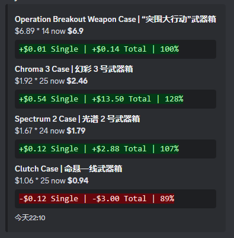

# Skinwatch Discord Bot
**Skinwatch is a Discord bot that can send you price updates of your specified skins at specified intervals.** You can specify the amount and prices of skins you have purchased them for in the configurations, and it can tell you the price differences compared to the live price.

## Setup
1. You will need node.js. Clone the repository.
2. Rename `.env.example` to `.env`, and edit the contents accordingly.
3. Rename `skins.example.js` to `skins.js` and enter the data you want accordingly. An example and instructions have been provided for you.

> **NOTE:** Steam market has a heavy rate limit for the API, so you should keep the amount of skins under 10.

4. Run `npm i` then run `npm run start` to start the bot.

## Usage
When the bot is active, it will send you the skins' live information at the specified schedule in your `.env`. You can also send `!sendskins` to its DMs to trigger it manually, **but try to do it at long intervals to avoid hitting the rate limit.**

## Suggestions/feedback
If you encounter any issues with the bot or have a suggestion, you are welcome to open an issue in this repository!

## See also
[How do I get a Discord token?](https://github.com/reactiflux/discord-irc/wiki/Creating-a-discord-bot-&-getting-a-token)
[Cronjob editor](https://crontab.guru/)